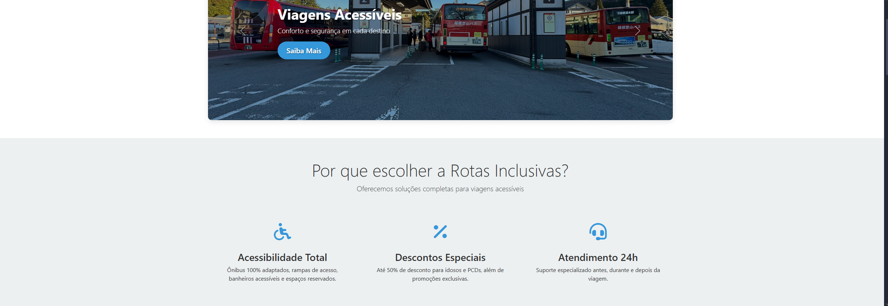
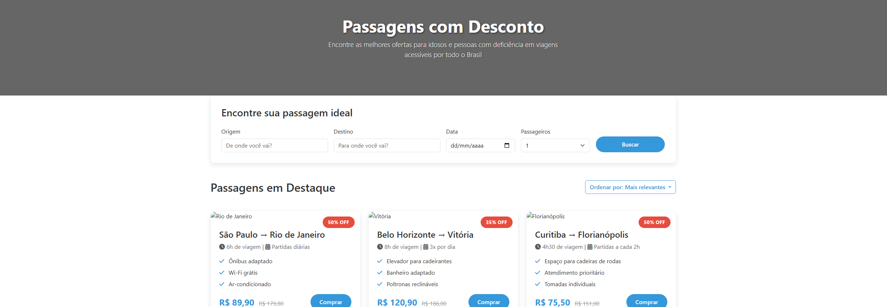
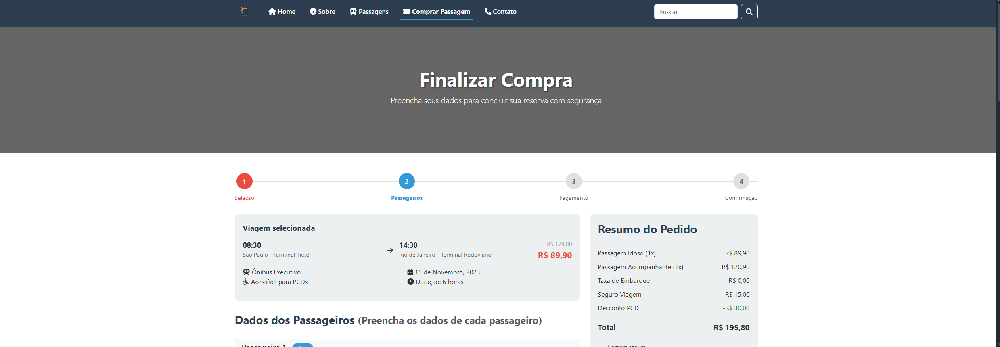

# 🌍 Rota Inclusiva

**Rota Inclusiva** é um projeto web que visa facilitar o acesso de **idosos** e **pessoas com deficiência (PCDs)** a **passagens rodoviárias com desconto**, oferecendo uma interface acessível, moderna e informativa. Idealizado como parte de um trabalho acadêmico, o sistema destaca o direito à mobilidade e à inclusão social.

## 🧭 Funcionalidades

- 🚌 **Listagem de rotas com desconto**
- 💺 Destaque para ônibus com acessibilidade (Wi-Fi, banheiro adaptado, elevador)
- 💰 Descontos aplicados de forma clara (até 50% OFF)
- 📱 Layout responsivo (compatível com dispositivos móveis e desktop)
- 📑 Informações legais sobre os direitos de PCDs e idosos
- 🔎 Barra de busca de rotas

## 🖥️ Tecnologias Utilizadas

- HTML5
- CSS3
- [Bootstrap 5](https://getbootstrap.com/)
- JavaScript (planejado para futuras melhorias interativas)
- Imagens ilustrativas representando os destinos

## 📁 Estrutura de Arquivos 

```
📂 RotasInclusivas/
├── inicialpage.html         # Página inicial
├── passagens.html           # Página com listagem de rotas e descontos
├── compra.html              # Página de simulação de compra
├── styles.css               # Estilos personalizados
├── img/                     # Imagens do site (logo, destinos, etc)
└── README.md                # Este arquivo
```

## 📸 Demonstrações

### Página Inicial
Apresentação da proposta do projeto e navegação amigável.  


### Página de Passagens
Cards com promoções e informações acessíveis.  


### Página de Compra
Simulação simples da escolha da passagem.  

## ⚖️ Base Legal

O projeto foi baseado em leis brasileiras que garantem benefícios a idosos e PCDs:
- **Lei 10.741/2003 (Estatuto do Idoso)**: garante descontos em passagens interestaduais.
- **Lei 13.146/2015 (Lei Brasileira de Inclusão)**: assegura acessibilidade e prioridade.

## 📌 Objetivo Acadêmico

Este projeto foi desenvolvido como parte do curso universitário abrangendo o tema **Mobilidade e Urbanismo**, com o intuito de promover a inclusão digital e social por meio de soluções acessíveis para o transporte público.
